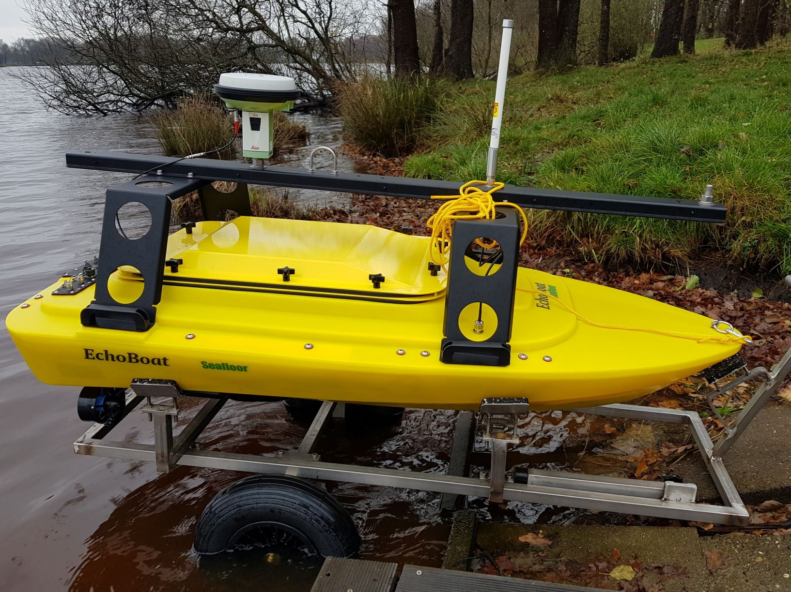

# Dieses Repository ist in Bearbeitung! // Work in progress!

# EchoBoat Dokumentation
Dieses Repository enthält eine Darstellung der Systeme und Peripherie des Echoboats. Für den Betrieb in der Vermessung soll hier eine Sammlung relevanter Notizen, Anleitungen und Beschreibungen entstehen.
Ein manuell gesteuertes USV (Seafloor Echoboat 160) wird zu einem autonomen Fahrzeug (ASV) für bathymetrische Aufgaben umgerüstet. Das Seafloor Echoboat-160 ist eine Multi-Sensor Plattform für Bathymetrie / Gewässervermessung.



## Pläne
- [Übersicht](./electrical_schemes/overview/overview.md)
  - [Stromverteilung](./electrical_schemes/overview/out/EchoBoat%20Power%20Distribution%20Overview.png)
  - [Daten](./electrical_schemes/overview/out/EchoBoat%20Data%20Distribution%20Overview.png)

- Sensoren

## Anleitungen
 - [Ladestrategie](docs/energy/basics.md)
 - [Akku laden](docs/energy/charging.md)
 - [Steuerung](./docs/remotecontrol/rc.md)
 - Akku entladen
## Beschreibungen
### Komponenten
- Schiffskörper / Rumpf
  - Seafloor Systems Echoboat 160 [manufacturer link](https://www.seafloorsystems.com/usv)
- Steuerung
  - FrySky RX4R Empfänger [manufacturer link](https://www.frsky-rc.com/product/rx4r/)
  - Holybro Pixhawk 4 [manufacturer link](http://www.holybro.com/product/pixhawk-4/)
- Antrieb
  - ESC Quicrun WP8 BL150 (2\*)
  - Motore Bluerov Thruster T100 (2\*) [manufacturer link](https://bluerobotics.com/store/retired/t100-thruster/) 
- Akkus
  - LiPo Turnigy 4S1P 16000mAh für Antrieb (2\*2) [manufacturer link](https://hobbyking.com/de_de/turnigy-high-capacity-16000mah-4s-12c-multi-rotor-lipo-pack-w-xt90.html)
  - LiPo Turnigy 6S1P 20000mAh für Vermessung (2\*) [manufacturer link](https://hobbyking.com/de_de/turnigy-high-capacity-16000mah-4s-12c-multi-rotor-lipo-pack-w-xt90.html)
  - LiPo Venom 6S1P 22000mAh für Vermessung (2\*) [manufacturer link](https://www.venompower.com/venom-22000mah-6s-22-2v-drone-professional-battery-15c-lipo-with-xt150-as150-35000) 
- Sensoren
  - SBES Teledyne Marine ODOM Echotrac CV100 [manufacturer link](http://www.teledynemarine.com/singlebeam-hydrographic-echosounders)
  - [Schwinger Airmar 191](./docs/sensors/transducer.md)
  - IMU SBG Ellipse E [manufacturer link](https://www.sbg-systems.com/products/ellipse-series/#ellipse-e_miniature-ins)
  - GNSS Leica GS15
  - GNSS-Controller Leica CS20 [manufacturer link](https://leica-geosystems.com/de-de/products/gnss-systems/controllers/leica-cs20)
  - Webcam Logitech C270
  - Holybro Power Module PM02 V2 (2\*) [manufacturer link](http://www.holybro.com/product/power-modulepm02-v3/) 
- [Industrie-PC](./docs/misc/pc-hardware.md)
  - [Network](./docs/misc/network.md)
  - [Users](./docs/misc/user.md)
- Ground Control Station
  - [Fernsteuerung FrSky Taranis Q X7 ACCST](./docs/remotecontrol/rc.md) 
  - Wlan-Antenne Mikrotik
  - [Laptop](./docs/misc/laptop.md) 
- Lade-Segment
  - ISDT P30
  - ISDT SP3060
  - ISDT FD-200


## Danksagung

Vielen Dank für die eingeräumten Freiheiten, das Feedback und die praktische und technische Unterstützung an

- Harry Wirth,
- Thorsten Roelfs,
- Stefan Scheidweiler und
- Tobias Berndt.

## Links

## Lizenz

Der vollständige Lizenztext befindet sich in [LICENSE][1].

```
Copyright (C) 2020 - 2021 Malte Biermann

This program is free software: you can redistribute it and/or modify
it under the terms of the GNU General Public License as published by
the Free Software Foundation, either version 3 of the License, or
(at your option) any later version.

This program is distributed in the hope that it will be useful,
but WITHOUT ANY WARRANTY; without even the implied warranty of
MERCHANTABILITY or FITNESS FOR A PARTICULAR PURPOSE. See the
GNU General Public License for more details.

You should have received a copy of the GNU General Public License
along with this program. If not, see <http://www.gnu.org/licenses/>.
```

[1]: https://github.com/MalteBiermann/EchoBoat/LICENSE
