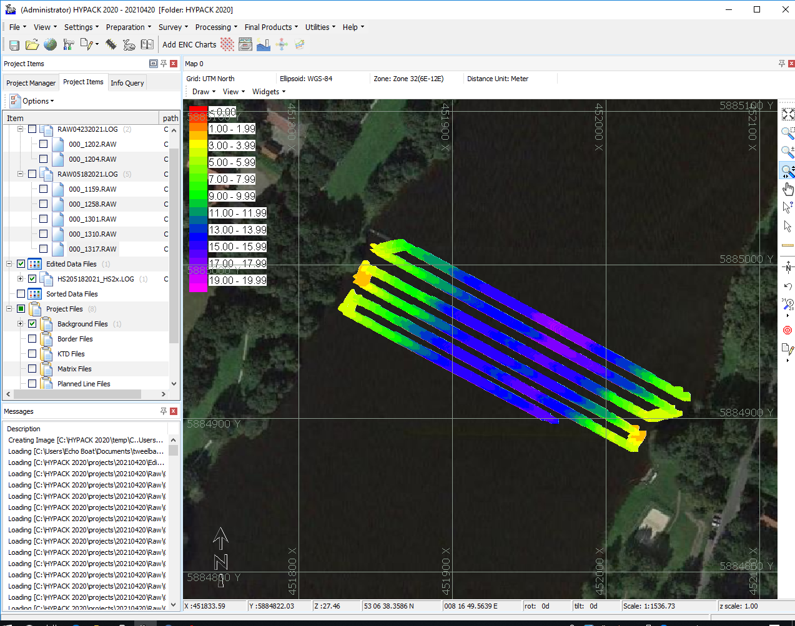
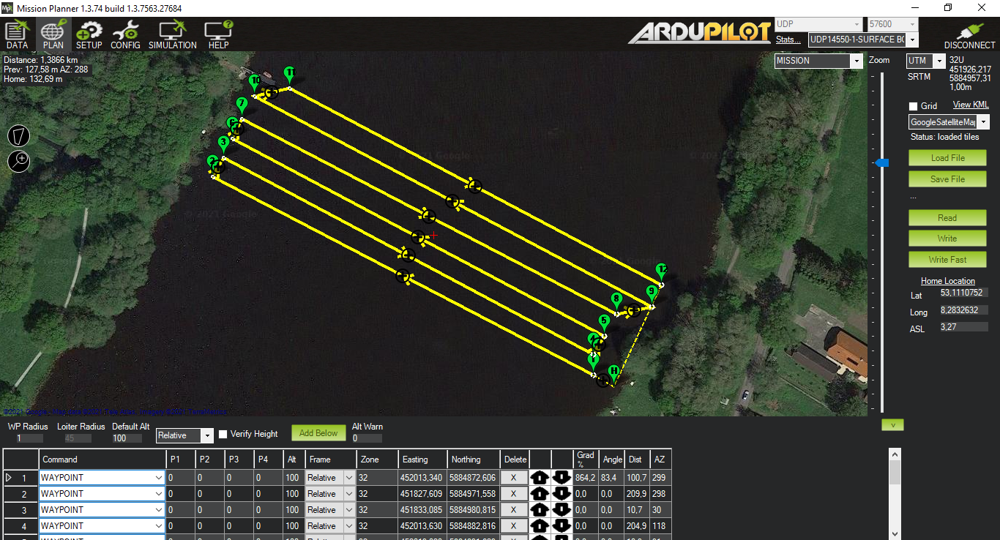

# Project EchoBoat Documentation
In transition to english.
## Beschreibung
Das Seafloor Echoboat-160 ist eine Multi-Sensor Plattform für Bathymetrie / Gewässervermessung. Das EchoBoat ist ein ursprünglich manuell gesteuertes **U**nmanned **S**urface **V**ehicle und wird zu einem autonomen Fahrzeug (**A**SV) umgerüstet.
Für den Betrieb in der Vermessung soll hier eine Sammlung relevanter Notizen, Anleitungen und Beschreibungen entstehen.

<!--  -->




## Schematics
- [Power](./electrical_schemes/overview/out/EchoBoatPowerDistributionOverview.png)
- [Data](./electrical_schemes/overview/out/EchoBoatDataDistributionOverview.png)
- [Helm](./electrical_schemes/overview/out/EchoBoatHelmOverview.png)
<!-- - Sensoren -->

## ROS
 - [Docker environment](./docs/ros_docker/docker.md)
 - [ROS](./docs/ros_docker/ros.md)

## Configuration
- [ArduRover](./docs/ardupilot/ardurover.md)
- [Remote Control](./docs/remotecontrol/rc.md)

## Manuals
 - [Ladestrategie](./docs/energy/basics.md)
 - [Akku laden](./docs/energy/charging.md)
 - [Steuerung](./docs/remotecontrol/rc.md)
 - [Akku entladen](./docs/energy/discharging.md)

## Notes
- [Transducer Airmar 191](./docs/sensors/transducer.md)
- [Remote Control FrSky Taranis Q X7 ACCST](./docs/remotecontrol/rc.md)
- [Nuvo fanless PC onboard](./docs/misc/pc-hardware.md)
- [Laptop](./docs/misc/laptop.md)
- [Network](./docs/misc/network.md)
- [Users](./docs/misc/user.md)

## BOM (Bill of material)
### Hardware
- Hull
  - Seafloor Systems Echoboat 160 [manufacturer link](https://www.seafloorsystems.com/usv)
- Control
  - FrySky RX4R Receiver [manufacturer link](https://www.frsky-rc.com/product/rx4r/)
  - Holybro Pixhawk 4 [manufacturer link](http://www.holybro.com/product/pixhawk-4/)
- Ground Control Station
  - FrSky Taranis Q X7 ACCST
  - Wifi-Antenna Mikrotik
  - Laptop
- Propulsion
  - ESC Quicrun WP8 BL150
  - Thruster Bluerov T100 [manufacturer link](https://bluerobotics.com/store/retired/t100-thruster/)
- Batteries / LiPo
  - Turnigy 4S1P 16000mAh for propulsion [manufacturer link](https://hobbyking.com/de_de/turnigy-high-capacity-16000mah-4s-12c-multi-rotor-lipo-pack-w-xt90.html)
  - Turnigy 6S1P 20000mAh for survey [manufacturer link](https://hobbyking.com/de_de/turnigy-high-capacity-16000mah-4s-12c-multi-rotor-lipo-pack-w-xt90.html)
  - Venom 6S1P 22000mAh for survey [manufacturer link](https://www.venompower.com/venom-22000mah-6s-22-2v-drone-professional-battery-15c-lipo-with-xt150-as150-35000)
- Sensors
  - ~~Lidar Velodyne VLP-32C / Ultra Puck [manufacturer link](https://velodynelidar.com/products/ultra-puck/)~~
  - SBES Teledyne Marine ODOM Echotrac CV100 [manufacturer link](http://www.teledynemarine.com/singlebeam-hydrographic-echosounders)
  - Transducer Airmar 191
  - IMU SBG Ellipse E [manufacturer link](https://www.sbg-systems.com/products/ellipse-series/#ellipse-e_miniature-ins)
  - GNSS Leica GS15
  - GNSS-Controller Leica CS20 [manufacturer link](https://leica-geosystems.com/de-de/products/gnss-systems/controllers/leica-cs20)
  - Webcam Logitech C270
  - Holybro Power Module PM02 V2 [manufacturer link](http://www.holybro.com/product/power-modulepm02-v3/)
- Embedded fanless PC onboard Nuvo 5006LP

- Battery Charger
  - ISDT P30
  - ISDT SP3060
  - ISDT FD-200

### Software
- ArduRover 4.1.0-dev [project link](https://ardupilot.org/rover/index.html)
- OpenTX [project link](https://www.open-tx.org/)
- Missionplanner [project link](https://ardupilot.org/planner/)
- Xylem Hypack Ultralight [manufacurer link](https://www.hypack.com/product/id-HYPACK-ULTRALITE/HYPACK%c2%ae-ULTRALITE)
- ~~QPS Qinsy~~
- ~~QPS Qimera~~


## Danksagung

Vielen Dank für die eingeräumten Freiheiten, das Feedback und die praktische und technische Unterstützung an

- Harry Wirth,
- Thorsten Roelfs,
- Stefan Scheidweiler und
- Tobias Berndt.

<!-- ## Links -->

## Lizenz

Der vollständige Lizenztext befindet sich in [LICENSE][1].

```
Copyright (C) 2020 - 2021 Malte Biermann

This program is free software: you can redistribute it and/or modify
it under the terms of the GNU General Public License as published by
the Free Software Foundation, either version 3 of the License, or
(at your option) any later version.

This program is distributed in the hope that it will be useful,
but WITHOUT ANY WARRANTY; without even the implied warranty of
MERCHANTABILITY or FITNESS FOR A PARTICULAR PURPOSE. See the
GNU General Public License for more details.

You should have received a copy of the GNU General Public License
along with this program. If not, see <http://www.gnu.org/licenses/>.
```

[1]: https://github.com/MalteBiermann/EchoBoat/LICENSE
