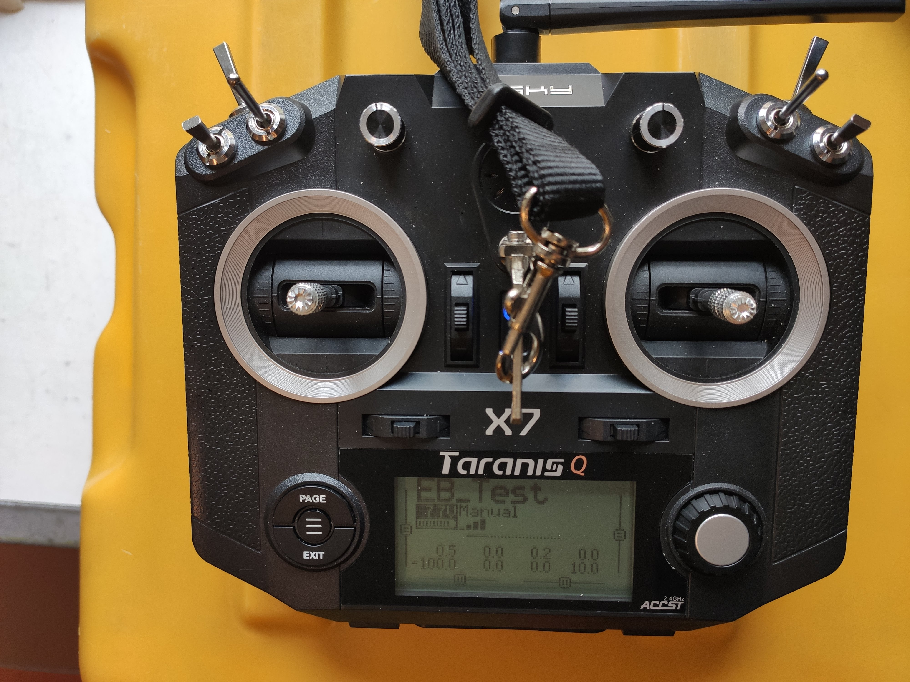

# FrSky Q X7 ACCST Remote Control
- Akku
    - 6S NiMH
- Frequenz
    - 2.4GHz
- [OpenTx](https://www.open-tx.org/)
    - [Config](../../configuration/remotecontrol/opentx_config.otx)
- [manufacturer link](https://www.frsky-rc.com/product/taranis-q-x7-2/) 

## Configuration
- Skid Steering with Reverse
    - Left + Right Stick (J1, J2, J3, J4)
- Disarm / Arm
    - SF
- ArduRover-Mode
    - Virtual Switch (max. 9 Positions)  
        - SA + SB (each 3 Positions)
    - Manual
    - Loiter
    - RTL
    - SmartRTL
    - Auto
    - Guided
